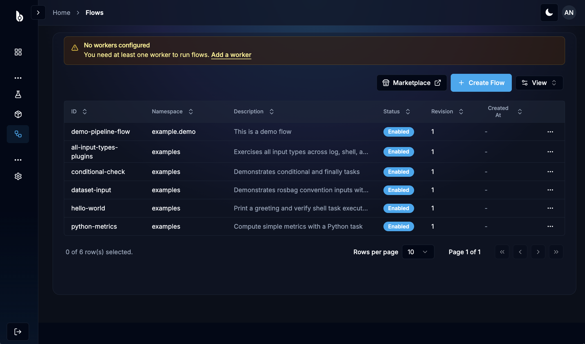
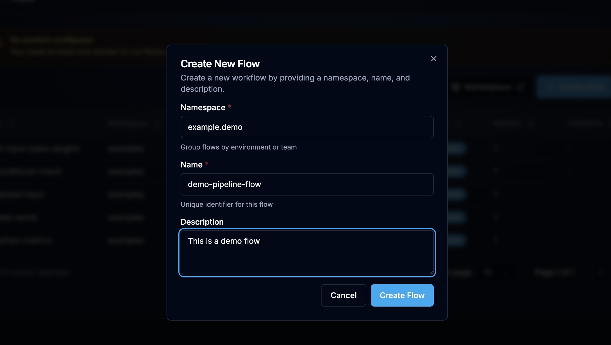
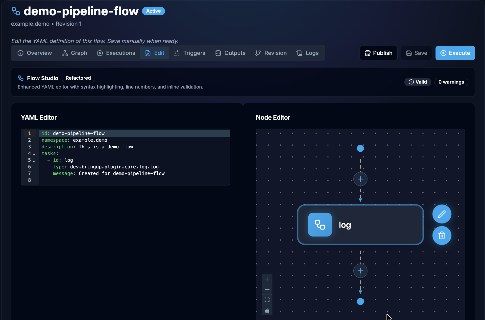

# Flow Creation Guide

> A step-by-step guide to creating, validating, and running your first Flow.

---

## Table of Contents

1. [Prerequisites](#prerequisites)
2. [Step 1: Open the Flow Editor](#step-1-open-the-flow-editor)
3. [Step 2: Define Flow Metadata](#step-2-define-flow-metadata)
4. [Step 3: Add Inputs](#step-3-add-inputs)
5. [Step 4: Add Variables](#step-4-add-variables)
6. [Step 5: Add Tasks](#step-5-add-tasks)
7. [Step 6: Define Outputs](#step-6-define-outputs)
8. [Step 7: Validate the Flow](#step-7-validate-the-flow)
9. [Step 8: Save and Create](#step-8-save-and-create)
10. [Step 9: Execute the Flow](#step-9-execute-the-flow)
11. [Step 10: Review Results](#step-10-review-results)
12. [Complete Examples](#complete-examples)

---

## Prerequisites

Before creating a flow, ensure you have:

- Access to the Bag Master extension (login at your organization's Bringup instance)
- A namespace assigned to your team/project
- Knowledge of the task types you want to use (see [Plugin Reference](../index.md#task-plugins))

---

## Step 1: Open the Flow Editor

Navigate to the **Flows** section in the Bag Master extension and click the flow sidebar item.



Click the **"Create Flow"** button to create a new flow. This will ask you to enter few basic details.



<!-- PLACEHOLDER: Screenshot showing the empty Flow Editor with the YAML editor panel on the left and the visual preview on the right. The editor has syntax highlighting and line numbers. A toolbar at the top shows "Create Flow", "Validate", and "Save" buttons. -->

Go to the Edit tab, there you'll see a YAML editor where you can write your flow definition. The editor provides:

- Syntax highlighting for YAML
- Auto-completion for task types and properties
- Real-time validation feedback



---

## Step 2: Define Flow Metadata

Start with the flow's identity and description:

```yaml
id: demo-pipeline-flow
namespace: example.demo
description: This is a demo flow
labels:
  category: tutorial
  difficulty: beginner
tasks:
  - id: log
    type: dev.bringup.plugin.core.log.Log
    message: Created for demo-pipeline-flow

```

<!--  -->

<!-- PLACEHOLDER: Screenshot showing the top portion of the flow editor with the id, namespace, and description fields filled in. A sidebar panel may show a visual form for these metadata fields with the namespace shown as a dropdown. -->

**Rules:**

- `id` must match `^[a-zA-Z0-9][a-zA-Z0-9._-]*$` (letters, numbers, dots, underscores, hyphens)
- `namespace` must be lowercase: `^[a-z0-9][a-z0-9._-]*$`
- `description` is optional but highly recommended
- `labels` are optional key-value pairs for organization

---

## Step 3: Add Inputs

Inputs define the parameters users provide when running the flow. The Bag Master extension supports **13 input types**.

```yaml
inputs:
  - id: dataset_name
    type: STRING
    required: true
    description: Name of the dataset to process
    display_name: Dataset Name

  - id: sample_count
    type: INT
    required: false
    defaults: 100
    min: 1
    max: 10000
    description: Number of samples to process

  - id: output_format
    type: ENUM
    values:
      - csv
      - json
      - parquet
    defaults: csv
    description: Output file format

  - id: verbose
    type: BOOLEAN
    defaults: false
    description: Enable verbose logging
```

<!--  -->

<!-- PLACEHOLDER: Screenshot showing the inputs section of the flow editor. Each input is displayed as a collapsible card showing the input id, type badge (STRING, INT, ENUM, BOOLEAN), required indicator, default value, and description. An "Add Input" button is visible at the bottom. -->

For the full list of input types and their validation rules, see the [Inputs Reference](./inputs-reference.md).

---

## Step 4: Add Variables

Variables are environment variables available to all tasks. They're ideal for shared configuration:

```yaml
variables:
  OUTPUT_DIR: /data/results
  LOG_LEVEL: INFO
  API_ENDPOINT: https://api.example.com/v1
```

<!--  -->

<!-- PLACEHOLDER: Screenshot showing the variables section as a simple key-value editor with three entries. Each row has a "Key" input field and a "Value" input field, with a delete icon on the right and an "Add Variable" button below. -->

Variables are referenced in tasks using `{{ variables.OUTPUT_DIR }}` syntax, which gets converted to `${OUTPUT_DIR}` environment variables during transpilation.

---

## Step 5: Add Tasks

Tasks are the core of your flow — they define the actual work to perform. Tasks execute sequentially in the order they're listed.

### 5a. Choose a Task Type

Select from the available task plugins:

| Task Type                                     | Use When...                                |
| --------------------------------------------- | ------------------------------------------ |
| [Shell](../Plugins/shell.md)                  | Running shell commands, scripts, CLI tools |
| [Python Script](../Plugins/python-script.md)  | Executing Python code with dependencies    |
| [Docker Run](../Plugins/docker-run.mdx)       | Running containers with specific images    |
| [ROS Bag Loader](../Plugins/rosbag-loader.md) | Downloading ROS bag files                  |
| [HTTP Request](../Plugins/http-request.md)    | Making API calls                           |
| [Log](../Plugins/log.md)                      | Logging messages for debugging/audit       |
| [Subflow](../Plugins/subflow.md)              | Calling another flow                       |

### 5b. Add Your First Task

```yaml
tasks:
  - id: log-start
    type: dev.bringup.plugin.core.log.Log
    message: 'Starting processing of {{ inputs.dataset_name }}'

  - id: process-data
    type: dev.bringup.plugin.scripts.python.Script
    dependencies:
      - pandas
      - numpy
    script: |
      import pandas as pd
      import os

      dataset = os.getenv("DATASET_NAME")
      count = int(os.getenv("SAMPLE_COUNT", "100"))
      fmt = os.getenv("OUTPUT_FORMAT", "csv")

      print(f"Processing {dataset} with {count} samples")
      print(f"Output format: {fmt}")

      # Your processing logic here
      df = pd.DataFrame({"sample": range(count)})

      output_path = f"{os.getenv('OUTPUT_DIR', '.')}/result.{fmt}"
      if fmt == "csv":
          df.to_csv(output_path, index=False)
      elif fmt == "json":
          df.to_json(output_path)

      print(f"Results written to {output_path}")
    outputFiles:
      - '*.csv'
      - '*.json'

  - id: log-complete
    type: dev.bringup.plugin.core.log.Log
    message: 'Processing complete for {{ inputs.dataset_name }}'
```

<!--  -->

<!-- PLACEHOLDER: Screenshot showing the tasks section with three tasks displayed as sequential cards in a vertical pipeline view. Each card shows: task ID, task type with a colored badge (Log=blue, Python=green, Shell=gray), a brief preview of the task configuration, and expand/collapse controls. Connecting lines between cards show the execution order. -->

### 5c. Configure Task Properties

Each task type has its own set of properties. Click on a task card to expand its configuration:

<!--  -->

<!-- PLACEHOLDER: Screenshot showing an expanded Python Script task configuration. The left side shows the YAML editor with syntax highlighting for the script field. The right side shows a visual form with sections for: Dependencies (tag-style input chips), Environment Variables (key-value rows), Output Files (list input), and Advanced Settings (timeout, retry, run_if collapsible section). -->

### 5d. Add Conditional Execution (Optional)

Use `run_if` to conditionally execute tasks:

```yaml
- id: verbose-debug
  type: dev.bringup.plugin.core.shell.Shell
  run_if: '{{ inputs.verbose }}'
  commands:
    - env | sort
    - df -h
    - free -m
```

### 5e. Add Error Handling (Optional)

Use `allow_failure`, `retry`, and error/finally tasks:

```yaml
- id: risky-task
  type: dev.bringup.plugin.core.shell.Shell
  allow_failure: true
  retry:
    type: exponential
    max_attempt: 3
    interval: '5s'
    max_interval: '60s'
    delay_factor: 2.0
  commands:
    - ./potentially-flaky-operation.sh
```

---

## Step 6: Define Outputs

Outputs expose values from task results for use by parent flows or external consumers:

```yaml
outputs:
  - id: result_path
    type: STRING
    value: '{{ task_outputs.process-data.output_path }}'
    description: Path to the generated result file

  - id: sample_count_processed
    type: INT
    value: '{{ task_outputs.process-data.count }}'
    description: Number of samples actually processed
```

<!--  -->

<!-- PLACEHOLDER: Screenshot showing the outputs section with two output entries. Each has fields for: ID, Type (dropdown showing STRING/INT/FLOAT etc.), Value (with template expression syntax highlighted), and Description. A helper tooltip shows available task_outputs references. -->

---

## Step 7: Validate the Flow

Before saving, validate your flow to catch errors early.

### Via the UI

Click the **"Validate"** button in the editor toolbar.

<!--  -->

<!-- PLACEHOLDER: Screenshot showing a green success banner at the top of the editor reading "Flow is valid" with a checkmark icon. Below the banner, a summary shows: "3 tasks validated, 0 errors, 0 warnings". -->

<!--  -->

<!-- PLACEHOLDER: Screenshot showing a red error banner with "2 validation errors found". Below it, an expandable error list shows: Error 1: "Task 'process-data': field 'script' is required for type dev.bringup.plugin.scripts.python.Script" with a link to line 25. Error 2: "Input 'dataset_name': pattern violation - id contains invalid characters" with a link to line 8. Each error has a severity icon and line reference. -->

### Via the API

```bash
# Validate without saving
curl -X POST https://api.dev.bringup.dev/flows/validate \
  -H "Content-Type: application/x-yaml" \
  -d @my-flow.yaml
```

**Response:**

```json
{
  "valid": true,
  "errors": [],
  "warnings": []
}
```

### Validate Transpilation Compatibility

Check if your flow can be converted to a Jenkinsfile:

```bash
curl -X POST https://api.dev.bringup.dev/transpiler/convert/jenkins/validate \
  -H "Content-Type: application/json" \
  -d @my-flow.json
```

**Response:**

```json
{
  "convertible": true,
  "totalTasks": 3,
  "validTasks": 3,
  "unsupportedTasks": [],
  "warnings": []
}
```

---

## Step 8: Save and Create

Once validated, click **"Save"** or use the API:

```bash
curl -X POST https://api.dev.bringup.dev/flows \
  -H "Content-Type: application/x-yaml" \
  -H "x-oidc-sub: your-user-id" \
  -d @my-flow.yaml
```

<!--  -->

<!-- PLACEHOLDER: Screenshot showing a success toast notification "Flow 'my-first-flow' created in namespace 'my-team' (revision 1)". The flow list page is visible behind it, showing the newly created flow with its ID, namespace, description, task count (3), and creation timestamp. -->

The flow is now stored with **revision 1**. Every subsequent update creates a new revision.

---

## Step 9: Execute the Flow

### Via the UI

1. Navigate to your flow and click **"Execute"**
2. Fill in the input form (generated automatically from your input definitions)
3. Click **"Run"**

<!--  -->

<!-- PLACEHOLDER: Screenshot showing the flow execution modal/page. A form is displayed with fields auto-generated from the flow inputs: "Dataset Name" (text input, required, red asterisk), "Sample Count" (number input with value 100, up/down arrows), "Output Format" (dropdown showing csv/json/parquet), "Verbose" (toggle switch, off). A "Run Flow" button is at the bottom right. The flow name and revision are shown at the top. -->

### Via the API

First, get the input schema:

```bash
curl https://api.dev.bringup.dev/flows/my-team/my-first-flow/schema
```

Then validate your inputs:

```bash
curl -X POST https://api.dev.bringup.dev/flows/my-team/my-first-flow/validate-inputs \
  -H "Content-Type: application/json" \
  -d '{
    "inputs": {
      "dataset_name": "sensor-data-2024",
      "sample_count": 500,
      "output_format": "json",
      "verbose": true
    }
  }'
```

Then trigger the transpiled Jenkins pipeline with those inputs.

---

## Step 10: Review Results

### Execution View

<!--  -->

<!-- PLACEHOLDER: Screenshot showing the execution detail page. A vertical timeline shows three stages: "log-start" (green checkmark, completed in 0.2s), "process-data" (spinning blue indicator, currently running, 12s elapsed), "log-complete" (gray circle, pending). A live console log panel on the right shows the output of the currently running task. The top banner shows: Flow ID, Revision, Start Time, Status: RUNNING. -->

### Console Output

<!--  -->

<!-- PLACEHOLDER: Screenshot showing the console output panel for the "process-data" task. The output displays: "Processing sensor-data-2024 with 500 samples", "Output format: json", then a progress indicator, followed by "Results written to /data/results/result.json". The console has a dark background with monospace font, timestamps on the left, and a "Copy Output" button in the top-right corner. -->

### Artifacts

<!--  -->

<!-- PLACEHOLDER: Screenshot showing the artifacts panel listing archived files: "result.json (2.4 KB)" and "result.csv (1.8 KB)" with download icons next to each. A "Download All" button is at the top right. File type icons distinguish JSON and CSV files. -->

---

## Complete Examples

### Example 1: Simple Shell Flow

```yaml
id: hello-world
namespace: examples
description: Print a greeting

inputs:
  - id: user_name
    type: STRING
    required: false
    defaults: Bringup User

tasks:
  - id: greet
    type: dev.bringup.plugin.core.shell.Shell
    commands:
      - echo "Hello {{ inputs.user_name }}!"
      - echo "Welcome to Bringup Flows"
      - date
```

### Example 2: ROS Bag Processing Pipeline

```yaml
id: rosbag-pipeline
namespace: robotics
description: Download, analyze, and report on ROS bag data

inputs:
  - id: rosbag_id
    type: STRING
    required: true
    description: ID of the ROS bag to process
  - id: analysis_type
    type: ENUM
    values: [quick, full, deep]
    defaults: quick

variables:
  BM_ROSBAGS_DIR: /tmp/bagmaster/rosbags
  BM_ROSBAGS_MANIFEST_PATH: /tmp/bagmaster/rosbags/manifest.json

tasks:
  - id: bm_rosbag_loader
    type: dev.bringup.plugin.core.rosbag.LoadById

  - id: analyze
    type: dev.bringup.plugin.scripts.python.Script
    dependencies:
      - rosbags
      - matplotlib
      - numpy
    script: |
      import json
      import os

      manifest_path = os.getenv("BM_ROSBAGS_MANIFEST_PATH")
      analysis_type = os.getenv("ANALYSIS_TYPE", "quick")

      with open(manifest_path) as f:
          manifest = json.load(f)

      entries = manifest.get("entries", [])
      print(f"Analyzing {len(entries)} files ({analysis_type} mode)")

      for entry in entries:
          print(f"  File: {entry.get('filename')}")
          print(f"  Size: {entry.get('size', 0)} bytes")

      result = {"files_analyzed": len(entries), "mode": analysis_type}
      print(json.dumps(result))
    outputSchema:
      files_analyzed:
        type: INT

  - id: report
    type: dev.bringup.plugin.core.log.Log
    message: 'Analysis complete: {{ task_outputs.analyze.files_analyzed }} files processed'

outputs:
  - id: files_count
    type: INT
    value: '{{ task_outputs.analyze.files_analyzed }}'
```

### Example 3: Docker-Based CI/CD Pipeline

```yaml
id: docker-ci
namespace: ci
description: Build and test a project using Docker

inputs:
  - id: repo_url
    type: URI
    required: true
  - id: branch
    type: STRING
    defaults: main
  - id: run_integration_tests
    type: BOOLEAN
    defaults: false

tasks:
  - id: clone
    type: dev.bringup.plugin.core.shell.Shell
    commands:
      - git clone --branch {{ inputs.branch }} {{ inputs.repo_url }} workspace
      - cd workspace && git log --oneline -5

  - id: build
    type: dev.bringup.plugin.docker.run
    containerImage: node:20-alpine
    commands:
      - cd /app && npm ci
      - npm run build
    volumes:
      - hostPath: ./workspace
        path: /app
    timeout: '300s'

  - id: unit-tests
    type: dev.bringup.plugin.docker.run
    containerImage: node:20-alpine
    commands:
      - cd /app && npm test
    volumes:
      - hostPath: ./workspace
        path: /app

  - id: integration-tests
    type: dev.bringup.plugin.docker.run
    containerImage: node:20-alpine
    run_if: '{{ inputs.run_integration_tests }}'
    commands:
      - cd /app && npm run test:integration
    volumes:
      - hostPath: ./workspace
        path: /app
    timeout: '600s'

  - id: log-result
    type: dev.bringup.plugin.core.log.Log
    message: 'CI pipeline complete for {{ inputs.branch }}'
```

### Example 4: Multi-Stage Pipeline with Subflows

```yaml
id: deployment-pipeline
namespace: devops
description: Full deployment pipeline orchestrating subflows

inputs:
  - id: service_name
    type: STRING
    required: true
  - id: version
    type: STRING
    required: true
  - id: environment
    type: ENUM
    values: [staging, production]
    defaults: staging

tasks:
  - id: build
    type: dev.bringup.plugin.core.flow.Subflow
    flowId: build-service
    namespace: ci
    inputs:
      service: '{{ inputs.service_name }}'
      version: '{{ inputs.version }}'
    outputSchema:
      image_tag:
        type: STRING

  - id: test
    type: dev.bringup.plugin.core.flow.Subflow
    flowId: run-tests
    namespace: ci
    inputs:
      image: '{{ task_outputs.build.image_tag }}'
    outputSchema:
      passed:
        type: BOOLEAN

  - id: deploy
    type: dev.bringup.plugin.core.flow.Subflow
    flowId: deploy-service
    namespace: devops
    inputs:
      image: '{{ task_outputs.build.image_tag }}'
      environment: '{{ inputs.environment }}'

  - id: notify
    type: dev.bringup.plugin.core.http.Request
    url: https://hooks.slack.example.com/services/xxx
    method: POST
    headers:
      Content-Type: application/json
    body: |
      {
        "text": "Deployed {{ inputs.service_name }}:{{ inputs.version }} to {{ inputs.environment }}"
      }
```

---

## What's Next?

- [Inputs Reference](./inputs-reference.md) - Learn about all 13 input types
- [Advanced Features](./advanced-features.md) - Retry policies, concurrency, checks, and triggers
- [Plugin Reference](../index.md#task-plugins) - Detailed documentation for each task type
- [Marketplace](../index.md) - Share your flows with the community
