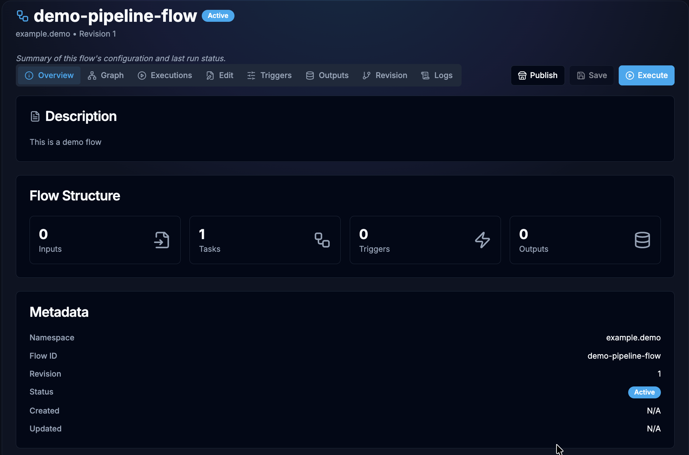

# Flow Reference


## Overview

Flows are YAML-based workflow definitions that describe automated pipelines for ROS bag processing, data analysis and more.

---

## Flow Structure at a Glance

```yaml
id: my-flow                           # Unique identifier
namespace: my-team                    # Organizational scope
description: What this flow does      # Human-readable description

inputs:                               # Parameters users provide at runtime
  - id: dataset_name
    type: STRING
    required: true

variables:                            # Environment variables available to all tasks
  OUTPUT_DIR: /data/results

tasks:                                # Sequential list of work to perform
  - id: step-1
    type: dev.bringup.plugin.core.shell.Shell
    commands:
      - echo "Processing {{ inputs.dataset_name }}"

outputs:                              # Values exposed after flow completion
  - id: result_path
    type: STRING
    value: "{{ task_outputs.step-1.path }}"
```

Once saved, a flow's **Overview** tab summarises that same structure — its inputs, tasks, triggers, and outputs — alongside its namespace, revision, and status. The **Edit** tab is where the YAML itself is authored, and **Execute** runs the flow.



---

## Documentation Index

### Task Plugins

Each plugin defines a task type you can use in your flow's `tasks` list.

| Plugin | Task Type | Description |
|--------|-----------|-------------|
| [Shell](./Plugins/shell.md) | `dev.bringup.plugin.core.shell.Shell` | Execute shell commands and scripts |
| [Python Script](./Plugins/python-script.md) | `dev.bringup.plugin.scripts.python.Script` | Run Python code with dependency management |
| [Docker Run](./Plugins/docker-run.mdx) | `dev.bringup.plugin.docker.run` | Run containers with full Docker configuration |
| [ROS Bag Loader](./Plugins/rosbag-loader.md) | `dev.bringup.plugin.core.rosbag.LoadById` | Download ROS bag files via JIT manifest |
| [HTTP Request](./Plugins/http-request.md) | `dev.bringup.plugin.core.http.Request` | Make HTTP/REST API calls |
| [Log](./Plugins/log.md) | `dev.bringup.plugin.core.log.Log` | Echo messages with template variable support |
| [Subflow](./Plugins/subflow.md) | `dev.bringup.plugin.core.flow.Subflow` | Compose flows by calling other flows as tasks |

### Guides

| Guide | Description |
|-------|-------------|
| [Flow Creation Guide](./guides/flow-creation-guide.md) | Step-by-step guide to creating your first flow |
| [Inputs Reference](./guides/inputs-reference.md) | All 13 input types with validation rules |
| [Advanced Features](./guides/advanced-features.md) | Retry, concurrency, checks, triggers, and more |

---

## Quick Start

### 1. Create a minimal flow

```yaml
id: hello-world
namespace: quickstart
description: My first Bringup flow

inputs:
  - id: name
    type: STRING
    defaults: World

tasks:
  - id: greet
    type: dev.bringup.plugin.core.shell.Shell
    commands:
      - echo "Hello, {{ inputs.name }}!"
```
---

## Template Expressions

Flows use Pebble-style template expressions throughout flow definitions:

| Expression | Resolves To | Example |
|------------|-------------|---------|
| `{{ inputs.<id> }}` | Input parameter value | `{{ inputs.user_name }}` |
| `{{ variables.<key> }}` | Flow variable | `{{ variables.OUTPUT_DIR }}` |
| `{{ task_outputs.<task_id>.<key> }}` | Output from a previous task | `{{ task_outputs.calculate.result }}` |

During transpilation, these are converted to shell environment variables:
- `{{ inputs.user_name }}` becomes `${USER_NAME}`
- `{{ variables.dataset_path }}` becomes `${DATASET_PATH}`

---


## Versioning

Every time a flow is updated via UI (yaml editor), a new **revision** is created. Previous revisions are preserved and can be retrieved by specifying the `revision` parameter when fetching flow details.

The latest revision is returned by default when no `revision` parameter is specified.
