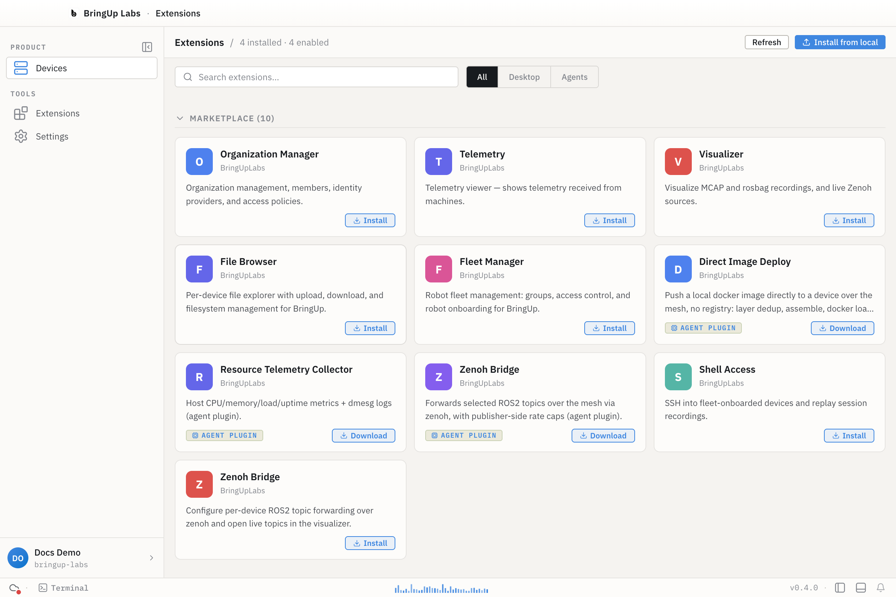

The desktop app on its own gives you a workbench and a connection to `bringupd`. Everything you actually do with a device — get a shell, browse files, deploy an image, manage a fleet — arrives through an extension. Eleven ship today. This page covers the model they share; each one also has its own reference page, linked from the table at the bottom.

## The Extensions view

The header reads "*N* installed · *N* enabled". Below it, a search box and **All** / **Desktop** / **Agents** filter tabs sit next to **Refresh** and **Install from local**. The grid below groups extensions into up to three collapsible sections — **Local**, **Marketplace**, and **Built-in** (built-in starts collapsed, since it's usually the longest list and the least often touched).

The marketplace catalog listed 10 entries when this was written. Three of those were badged **AGENT PLUGIN**, with a **Download** button in place of **Install**: **Direct Image Deploy**, **Resource Telemetry Collector**, and a Zenoh Bridge agent-plugin variant. Not everything in the [table below](#all-extensions) is installable from the marketplace this way — **Bag Master**, **Yocto Builder**, and **Rollouts** did not appear in the catalog.

**A naming note:** the marketplace lists **Direct Image Deploy**. The extension's own manifest (`displayName` in its `package.json`) says **Image Deploy**, and that's the name its [reference page](./image-deploy) and the table below use. Both names point at the same extension — if you're searching the marketplace for it, look for either.

## Where extensions come from

Every installed extension carries a source tag: `builtin`, `repo`, `bundled`, `local`, or `marketplace`.

- **builtin** ships with the desktop app itself. It's marked with a **built-in** badge and, unlike the others, can't be disabled or uninstalled from this view.
- **local** and **bundled** extensions were installed from a file or path on your machine — either bundled alongside the app, or added yourself via **Install from local**. Both group under the **Local** section in the view.
- **repo** extensions are tied to a repo or workspace you have open.
- **marketplace** extensions were installed from Bringup's extension marketplace.

## Install targets

An extension can install to more than one part of the system: **desktop** (the Electron app), **controller** (your own machine's `bringupd` daemon), or **agent** (a device's `bringupd` edge agent). Opening an extension's detail drawer shows an **Install Targets** section with one row per target — each reads **Install** (or **Update**, if a newer version is available for something already installed), or **not available** where that target doesn't apply to that extension.

## Permissions

Every extension declares the permissions it needs in its own manifest — for example `devices.read`, `devices.write`, `authentication.session`, or `terminal.execute`. The detail drawer for an installed extension lists its permissions and activation events, so you can see what it's asking for before you rely on it. Each extension's own reference page below lists the permissions read from its manifest.

## Workspace trust

Extensions sourced from a repo or a local path run against a workspace — a folder you've opened. Bringup tracks whether that workspace is trusted, and whether that trust came from a default or something you set yourself, before letting its extensions run.

## Enabling, disabling, and uninstalling

- **Enable / Disable** — any installed, non-builtin extension has a toggle for this (also available as **Enable extension** / **Disable extension** in its detail drawer). Built-in extensions don't show the toggle.
- **Uninstall** — only extensions sourced from `local` or `marketplace` can be uninstalled here; `builtin`, `repo`, and `bundled` ones can't. Uninstalling asks you to confirm, since it permanently removes the extension's files from disk — its stored settings and secrets are kept, so reinstalling later picks up where you left off.
- **Install from local** — opens a dialog titled **Install from local / URL**, with a **Drop / browse** tab (accepts a `.bringup-ext`, `.tar.gz`, or `.zip` file) and a **Path / URL** tab (an absolute path or a URL).
- **Refresh** re-pulls the marketplace catalog and your installed list. If a required extension is missing or isn't ready, a banner appears with its own **Reload** action.

## All extensions

| Extension | Version | What it does |
|---|---|---|
| [Fleet Manager](./fleet-manager) | 0.2.14 | Robot fleet management: groups, access control, robot onboarding |
| [Organization Manager](./organization-manager) | 0.2.9 | Members, identity providers, access policies |
| [Shell Access](./shell-access) | 0.1.7 | SSH into onboarded devices, replay session recordings |
| [File Browser](./file-browser) | 0.1.3 | Per-device file explorer with upload and download |
| [Telemetry](./telemetry) | 0.1.8 | Telemetry received from machines |
| [Visualizer](./visualizer) | 0.2.0 | MCAP and rosbag playback, live Zenoh sources |
| [Zenoh Bridge](./zenoh-bridge) | 0.1.1 | Per-device ROS 2 topic forwarding over Zenoh |
| [Image Deploy](./image-deploy) | 0.1.0 | Deploy local Docker images to devices, no registry |
| [Yocto Builder](./yocto-builder) | 0.1.0 | Build, monitor, and flash Raspberry Pi Yocto images |
| [Rollouts](./rollouts) | 0.1.0 | OTA rollouts, A/B experiments, artifact registry |
| [Bag Master](./bag-master/) | 0.1.0 | Rosbag post-processing, datasets, pipelines |
