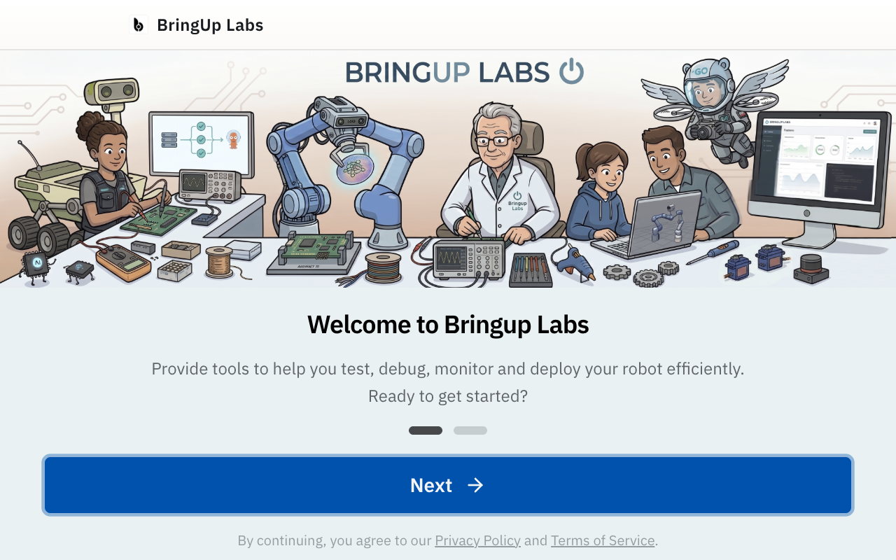
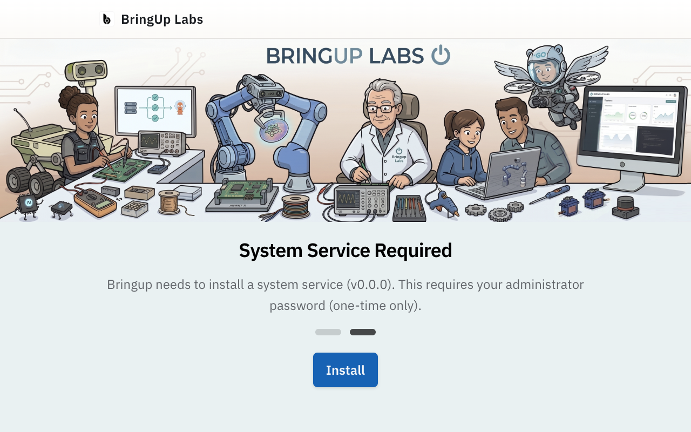
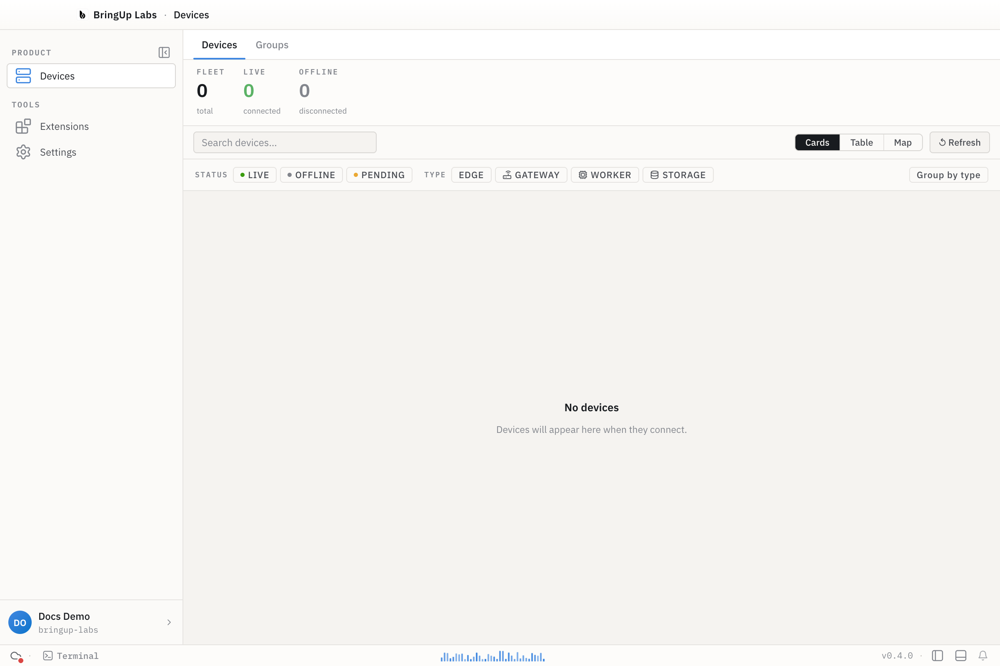

The first time you open Bringup, a two-step flow runs before the workbench appears: **Welcome**, then **Setup**.

## Step 1 — Welcome

The welcome screen introduces the app, with links to Bringup's privacy policy and terms of service. Click **Next** to continue.

## Step 2 — Setup

Setup installs `bringupd`, the privileged local daemon the desktop app talks to. Because this installs a system service, your OS asks for an administrator password — a one-time step. Click **Install** and enter your password when prompted.

If Docker isn't available on your machine, setup will also ask you to install it, since Bringup uses Docker to run containers and workloads.

When the daemon is running, the screen changes to **Service Installed** with a **Finish** button.

## What to expect when setup completes

Click **Finish** and Bringup opens the workbench — the main app window. From there you can [sign in](/get-started/sign-in) and [connect your first device](/get-started/connect-first-device).

A new install has no devices yet, so the fleet counters read zero.

## If the daemon doesn't start

Setup can fail — most often because the administrator password wasn't entered, or because a dependency like Docker is missing. The dialog shows a **Try Again** (or **Retry**) button for these cases.

If it still won't start, check the application logs:

- macOS: `~/Library/Logs/Bringup/main.log`
- Linux: `~/.config/Bringup/logs/main.log`

See the [FAQ](/faq) for further troubleshooting.
