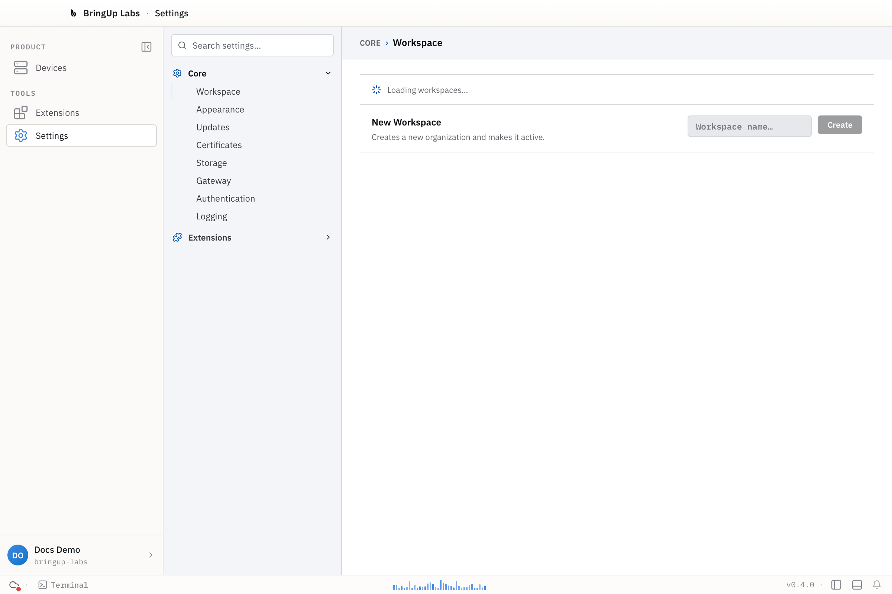

## Signing in

You can look around the workbench before signing in, but actions that need an account will prompt you to. Click your account icon at the bottom of the sidebar to sign in — Bringup opens your browser to authenticate, then returns you to the app.

## Personal vs. organization workspaces

Every workspace in Bringup is an organization, including your own. The first time you sign in, Bringup automatically creates and activates a personal workspace for you, named after your account (for example, "Jordan's workspace"). There's no setup step — you land in it right away.

Personal workspaces stay free: the Personal tier costs nothing and is available today.

If you already belong to one or more organizations, Bringup activates the only one automatically, or leaves the choice to you — via the workspace switcher — when you belong to more than one.

## Creating an organization

To create an additional organization, open the workspace switcher in the top bar and click **Manage workspaces**. Under **New Workspace**, enter a name (for example, `Acme Robotics`) and click **Create**. This creates a new organization and switches you into it immediately; you become its admin.

## Switching workspaces

The workspace switcher in the top bar, next to your account icon, lists every workspace you belong to. Click one to switch — this exchanges your session for that workspace's scope, so extensions like Fleet Manager show that workspace's devices and data instead.

Bringup keeps a local record of the organizations you belong to (`orgs.json`, alongside the app's other configuration files) so it can restore your active workspace the next time you launch it.
