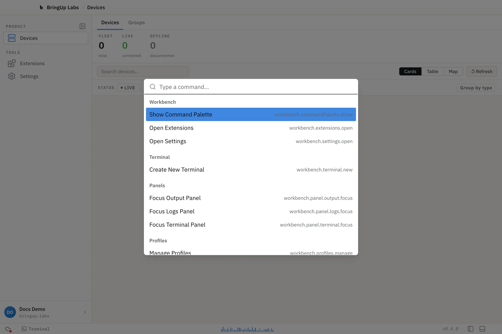
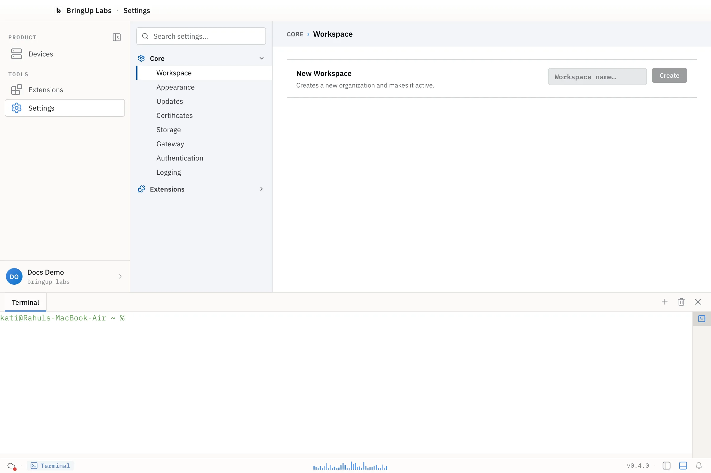

## Command palette

Press **Ctrl+Shift+P** (**Cmd+Shift+P** on macOS) to open the command palette. Type to filter, and press Escape to close it.

| Command | Shortcut |
|---|---|
| Show Command Palette | Ctrl+Shift+P (Cmd+Shift+P on macOS) |
| Open Extensions | Ctrl+Shift+X (Cmd+Shift+X on macOS) |
| Open Settings | Ctrl+, (Cmd+, on macOS) |
| Create New Terminal | Ctrl+\` (Cmd+\` on macOS) — see note below |
| Focus Output Panel | palette only, no keyboard shortcut |
| Focus Logs Panel | palette only, no keyboard shortcut |
| Focus Terminal Panel | palette only, no keyboard shortcut |
| Manage Profiles | palette only, no keyboard shortcut |

**Create New Terminal** is listed in the palette and has a keybinding, but isn't wired up to a handler yet — invoking it, from either the palette or the shortcut, does nothing.

## Terminal shortcuts

These apply inside the integrated terminal, which opens as a panel at the bottom of the workbench.

The modifier is **Cmd** on macOS and **Ctrl** everywhere else (shown as "Mod" below).

| Shortcut | Action |
|---|---|
| Mod+C | Copy the current selection. With nothing selected, this passes through to the shell instead (for example, as SIGINT). |
| Mod+V | Paste |
| Cmd+A (macOS only) | Select all |
| Cmd+K (macOS only) | Clear the terminal |
| Mod+= or Mod++ | Zoom in |
| Mod+- or Mod+_ | Zoom out |
| Mod+0 | Reset zoom |

Select all and clear are macOS-only by design — on other platforms, Ctrl+A and Ctrl+K are left alone so they still reach the shell, where readline binds them to start-of-line and kill-line.
