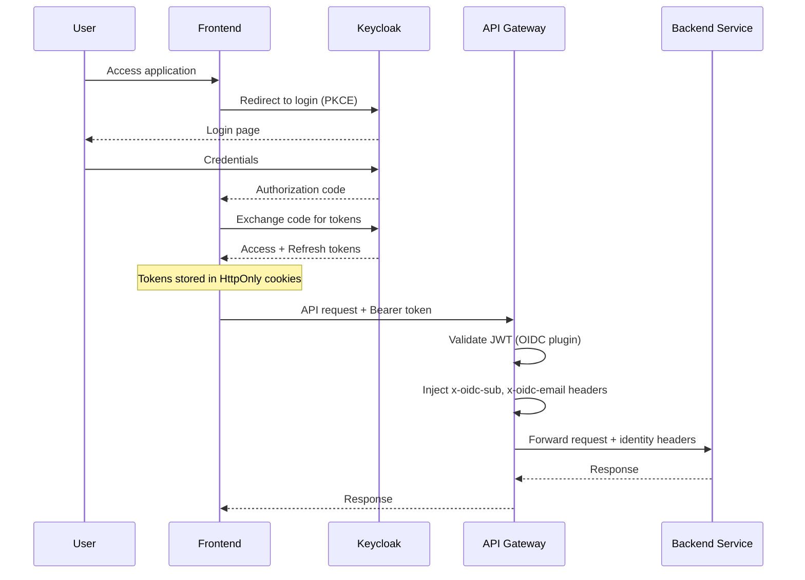
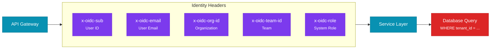
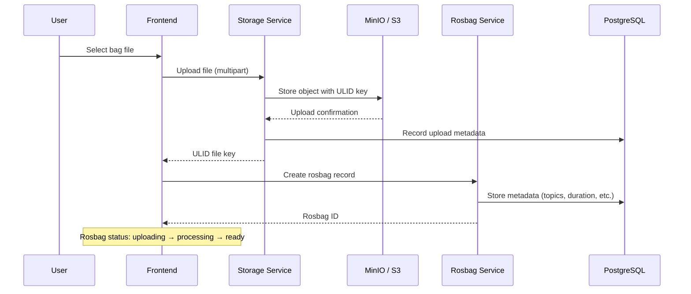
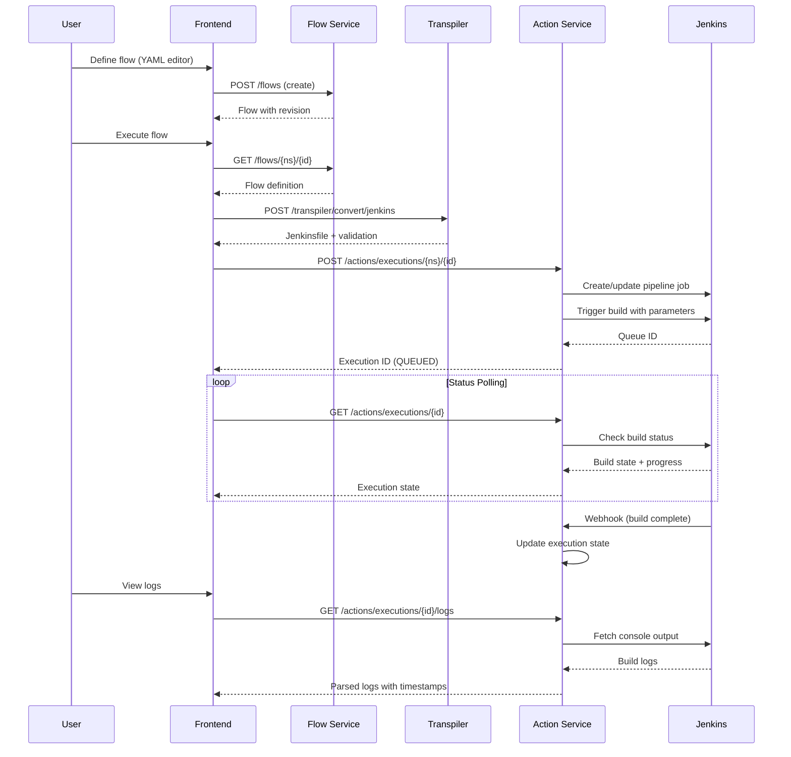
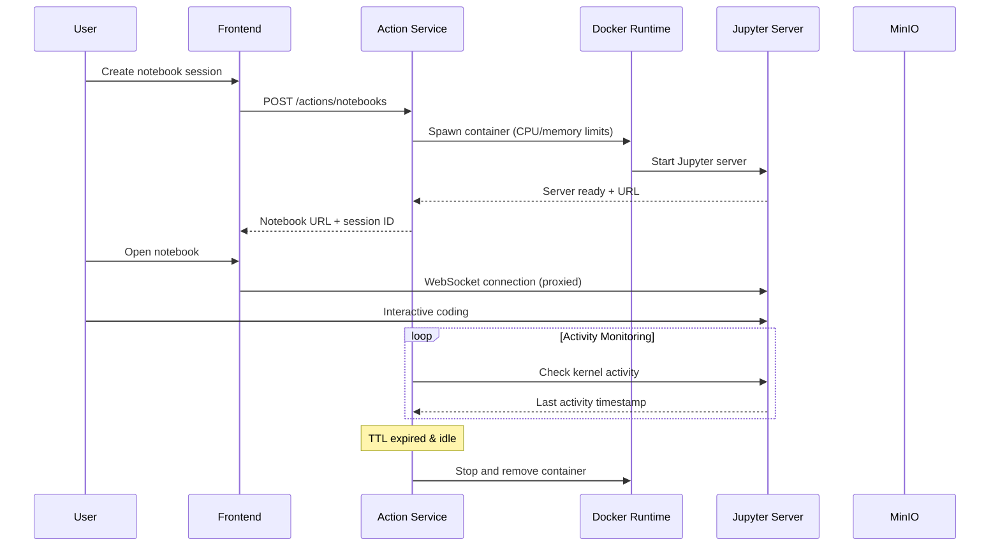
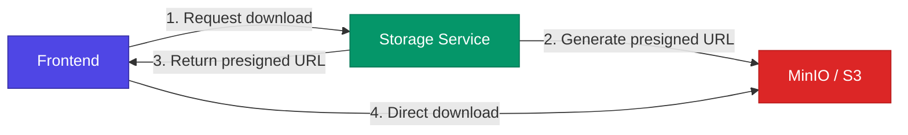

# Data Flow

This page traces the key data flows through the Bagmaster platform — from user authentication through bag file ingestion to pipeline execution.

---

## Authentication Flow

Every interaction with Bagmaster begins with authentication. The platform uses **OIDC with PKCE** for secure, token-based single sign-on.

:::tip Token Security
Access tokens are short-lived and stored in HttpOnly cookies — never accessible to client-side JavaScript. The frontend automatically refreshes tokens before expiry with a 30-second buffer for clock skew.
:::

---

## Multi-Tenant Identity Propagation

Once authenticated, tenant context flows through every layer of the system via HTTP headers.

Every database query is scoped by the user's tenant context. This ensures **complete data isolation** between organizations — one tenant can never access another tenant's data, even through direct API calls.

---

## Rosbag Ingestion Flow

When a user uploads a ROS bag file, the data flows through multiple services for storage, metadata extraction, and indexing.

**Key design decisions:**
- **ULID-based keys** ensure files are chronologically sortable and globally unique
- **Tenant-prefixed paths** in S3 (`org_id/team_id/user_id/`) enforce isolation at the storage layer
- **Metadata and files are decoupled** — the Rosbag Service manages metadata while the Storage Service manages binary data

---

## Pipeline Execution Flow

The most complex data flow in Bagmaster is pipeline execution, which spans four services.

**Execution states:** `CREATED` → `QUEUED` → `RUNNING` → `SUCCESS` | `WARNING` | `FAILED` | `KILLED`

:::note Tenant Isolation in Jenkins
Each organization gets its own Jenkins folder (`tenant-{org_id}`). Pipeline jobs are scoped to the tenant folder, ensuring complete execution isolation between organizations.
:::

---

## Interactive Notebook Flow

Users can launch isolated Jupyter environments for interactive data exploration.

**Resource governance:**
- Default limits: 500 MHz CPU, 512 MB memory
- TTL-based cleanup: Sessions expire after configurable idle timeout (default: 1 hour)
- Users can upload notebooks to persistent MinIO storage before session cleanup

---

## File Download Flow

The Storage Service optimizes downloads by redirecting clients directly to S3 via presigned URLs.

This pattern offloads bandwidth from the API layer, enabling efficient download of large bag files (often several GB) without proxying through application servers.
