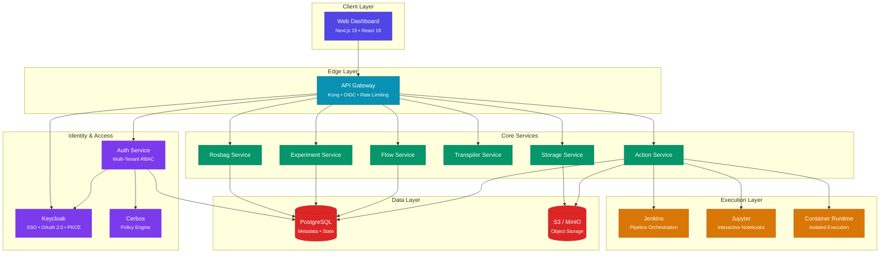

# Architecture Overview

Bagmaster is an **enterprise-grade, cloud-native platform** for managing ROS bag data, orchestrating data pipelines, and running experiments at scale. Built on a microservices architecture, it delivers the modularity, security, and scalability that production robotics and autonomous systems teams demand.

---

## High-Level Architecture

---

## Platform Capabilities

<table>
<tr>
<td width="50%">

### Data Management
- **Rosbag ingestion** with rich metadata indexing
- **Dynamic metadata exploration** via JSON path queries
- **Experiment tracking** with full lifecycle management
- **Multi-format support** for ROS 1 and ROS 2 bag files

</td>
<td width="50%">

### Pipeline Orchestration
- **Visual flow designer** with YAML-based definitions
- **Automatic transpilation** from flows to CI/CD pipelines
- **Parameterized execution** with input validation
- **Real-time status tracking** and log streaming

</td>
</tr>
<tr>
<td>

### Interactive Analysis
- **Jupyter notebook integration** with isolated environments
- **Action library** of reusable analysis scripts
- **Configurable compute resources** per session
- **Automatic idle cleanup** to optimize resource usage

</td>
<td>

### Enterprise Security
- **SSO via Keycloak** with OAuth 2.0 / PKCE
- **Multi-tenant isolation** at every layer
- **Policy-based authorization** with Cerbos
- **API rate limiting** and CORS enforcement

</td>
</tr>
</table>

---

## Design Principles

### Modularity

Every service is independently deployable, testable, and scalable. Services communicate exclusively through well-defined REST APIs via the API Gateway, ensuring loose coupling and clear domain boundaries.

### Security by Default

Authentication and authorization are enforced at the gateway level. Every request passes through OIDC validation before reaching any service. Tenant isolation is guaranteed through header-based identity propagation and database-level query scoping.

### Cloud-Native

Bagmaster is containerized end-to-end with Docker. Each service ships with its own `Dockerfile`, health checks, and database migrations. The platform runs on any infrastructure that supports container orchestration.

### Horizontal Scalability

All services are stateless by design. Database connections use async pooling. Object storage scales independently via S3-compatible backends. Pipeline execution fans out across distributed worker nodes.

---

## Technology Stack

| Layer | Technology | Purpose |
|-------|-----------|---------|
| **Frontend** | Next.js 15, React 19, Tailwind CSS | Server-rendered dashboard with real-time updates |
| **API Gateway** | Kong | Routing, OIDC auth, rate limiting, CORS |
| **Identity** | Keycloak, Cerbos | SSO, OAuth 2.0, policy-based authorization |
| **Services** | Python, FastAPI, async SQLAlchemy | High-performance async microservices |
| **Execution** | Jenkins, Jupyter, Docker | Pipeline orchestration and interactive analysis |
| **Database** | PostgreSQL | Metadata, state management, audit trails |
| **Storage** | MinIO / S3 | Scalable object storage for bag files and artifacts |
| **Orchestration** | Docker Compose | Service composition and deployment |

---

## What's Next

- **[System Design](./system-design)** — Deep dive into each service and how they interact
- **[Data Flow](./data-flow)** — Trace how data moves through the platform
- **[Storage Architecture](./storage)** — Object storage design and multi-tenant isolation
- **[Performance](./performance)** — Scalability patterns and optimization strategies
