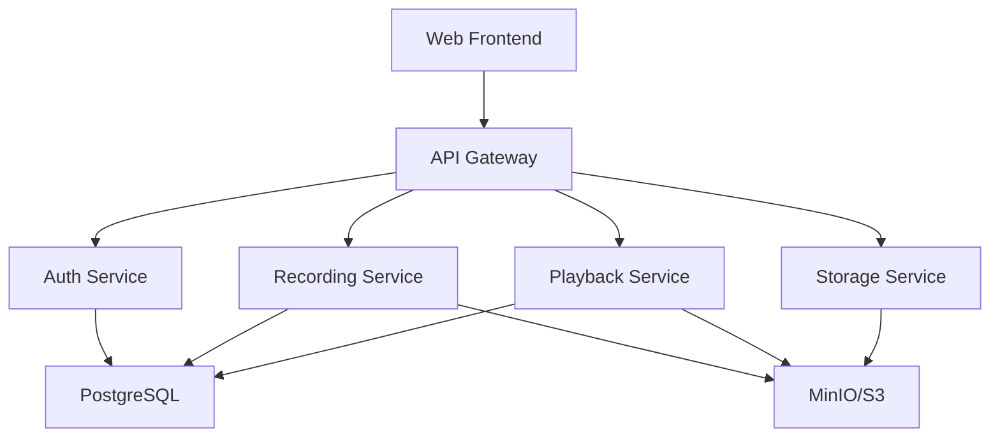

# Bagmaster Architecture

This document provides an overview of Bagmaster's architecture and design principles.

## System Components

Bagmaster is built as a modern microservices architecture:

### Frontend

- **Technology**: Next.js 14 with React 19
- **UI Library**: Tailwind CSS, shadcn/ui
- **State Management**: React Query, Zustand
- **Purpose**: User interface and visualization

### API Gateway

- **Technology**: Traefik
- **Purpose**: Route requests, load balancing, TLS termination

### Authentication Service

- **Technology**: FastAPI, Keycloak
- **Purpose**: User authentication, authorization, RBAC

### Recording Service

- **Technology**: Python, ROS 2
- **Purpose**: Manage bag file recording sessions

### Playback Service

- **Technology**: Python, ROS 2
- **Purpose**: Bag file playback and streaming

### Storage Service

- **Technology**: MinIO (S3-compatible)
- **Purpose**: Distributed object storage for bag files

### Database

- **Technology**: PostgreSQL 14+
- **Purpose**: Metadata, user data, recordings index

## Design Principles

### Scalability

- Horizontal scaling of services
- Distributed storage with MinIO
- Stateless API design

### Reliability

- Service health monitoring
- Automatic failover
- Data replication

### Performance

- Efficient bag file streaming
- Caching strategies
- Optimized database queries

### Security

- JWT-based authentication
- Role-based access control (RBAC)
- Encrypted storage

## Next Steps

- [System Design](./system-design) - Detailed component design
- [Data Flow](./data-flow) - How data moves through the system
- [Storage Architecture](./storage) - Storage implementation details
