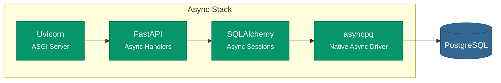
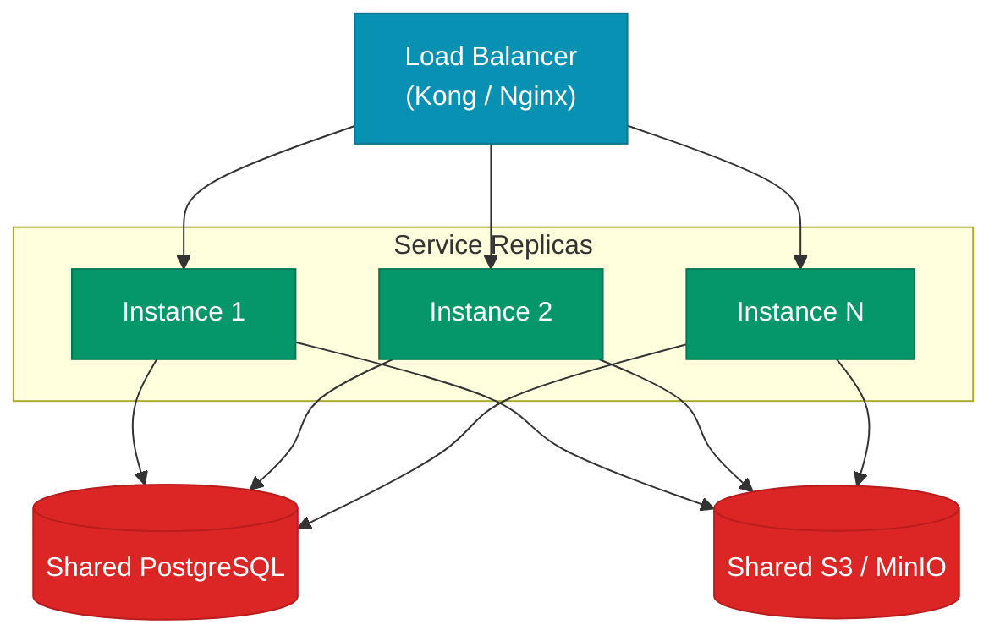
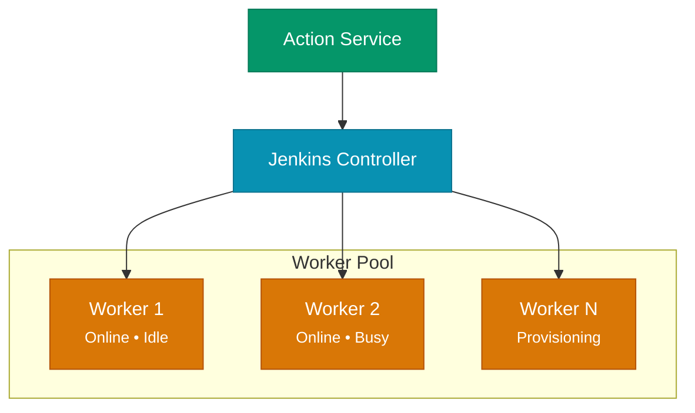
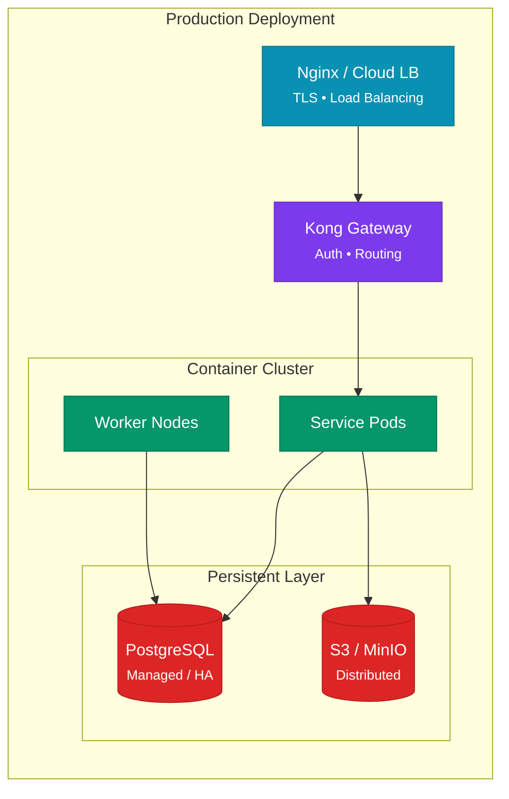

# Performance & Scalability

Bagmaster is engineered for production workloads — from small teams managing hundreds of bag files to enterprise deployments with terabytes of robotics data. This page covers the architectural patterns that enable scalability at every layer.

---

## Async-First Architecture

Every backend service in Bagmaster uses **fully asynchronous I/O**, ensuring high throughput under concurrent load without thread-pool exhaustion.



**Impact:** A single service instance can handle thousands of concurrent requests. Database queries never block the event loop, and connection pooling is managed automatically by SQLAlchemy's async engine.

---

## Horizontal Scaling

All services are **stateless by design** — no in-memory state, no local file dependencies, no sticky sessions. This enables straightforward horizontal scaling.



### Scaling Dimensions

| Component | Scaling Strategy | Bounded By |
|-----------|-----------------|------------|
| **API Gateway** | Horizontal replicas | CPU / network |
| **Backend Services** | Horizontal replicas per service | Database connections |
| **PostgreSQL** | Vertical scaling + read replicas | Storage / IOPS |
| **MinIO / S3** | Distributed mode across nodes | Storage capacity |
| **Jenkins Workers** | Dynamic agent provisioning | Compute budget |
| **Jupyter Sessions** | Per-user container allocation | Memory / CPU limits |

---

## Storage Performance

### Object Storage Optimization

Large file handling is critical for robotics workloads where bag files routinely exceed several gigabytes.

| Optimization | Description |
|-------------|-------------|
| **Presigned URL downloads** | Clients download directly from S3, bypassing the API layer entirely |
| **Native multipart uploads** | Files > 64 MB are automatically chunked for parallel upload |
| **ULID-based keys** | Timestamp-sortable IDs enable efficient range queries and chronological listing |
| **Connection pooling** | Singleton S3 client reuses connections across requests |

### Database Optimization

| Optimization | Description |
|-------------|-------------|
| **Indexed tenant columns** | `owner_id`, `org_id`, `team_id` are indexed for fast tenant-scoped queries |
| **JSONB indexing** | GIN indexes on metadata columns for fast JSON path queries |
| **Async connection pools** | SQLAlchemy manages connection lifecycle with automatic cleanup |
| **Pagination** | All list endpoints use offset-based pagination to bound result sets |

---

## Execution Scalability

### Pipeline Execution

Bagmaster distributes pipeline execution across **Jenkins worker nodes** that can be dynamically provisioned.



**Worker management features:**
- **Live health monitoring** — Architecture, disk space, clock drift, response time
- **Inbound agent protocol** — Workers connect to the controller (no inbound firewall rules needed)
- **Per-tenant folders** — Execution isolation at the Jenkins folder level

### Notebook Sessions

Interactive notebook sessions are governed by resource limits:

| Resource | Default | Configurable |
|----------|---------|-------------|
| CPU | 500 MHz | Per action / per session |
| Memory | 512 MB | Per action / per session |
| TTL | 3600 seconds | Per session |
| Idle timeout | Automatic | Based on kernel activity |

:::info Resource Governance
Idle sessions are automatically cleaned up based on Jupyter kernel activity monitoring. This prevents resource accumulation from abandoned sessions, keeping the compute pool available for active users.
:::

---

## Caching Strategies

| Layer | Strategy | Scope |
|-------|----------|-------|
| **Frontend** | React Query with stale-while-revalidate | Client-side query cache |
| **API Gateway** | Response caching for static resources | Edge cache |
| **Database** | PostgreSQL shared buffers + query plan cache | Server-side |
| **S3** | Presigned URL cache (15 min TTL) | Download acceleration |

---

## Monitoring & Observability

Every service exposes standardized health endpoints for orchestration platforms:

| Endpoint | Purpose | Response |
|----------|---------|----------|
| `GET /health` | Liveness probe | `{"status": "healthy"}` |
| `GET /health/ready` | Readiness probe | Includes database connectivity check |

### Health Check Configuration

```yaml
healthcheck:
  test: ["CMD", "curl", "-f", "http://localhost:8000/health/"]
  interval: 30s
  timeout: 30s
  start_period: 5s
  retries: 3
```

Services report health status to the container orchestrator, enabling automatic restart of unhealthy instances and graceful traffic shifting during deployments.

---

## Deployment Architecture



### Container Security

All production containers follow security best practices:

- **Non-root execution** — Services run as unprivileged `appuser`
- **Minimal base images** — `python:3.11-slim` reduces attack surface
- **No secrets in images** — All credentials injected via environment variables
- **Health checks** — Every container includes Docker health check configuration
- **Layer caching** — Dependencies installed before application code for efficient rebuilds
