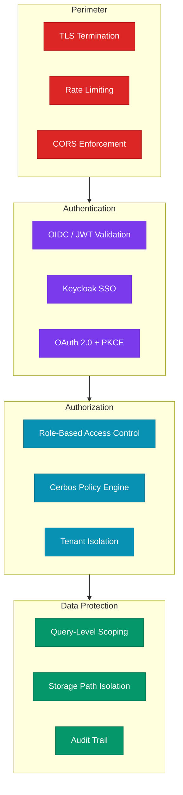
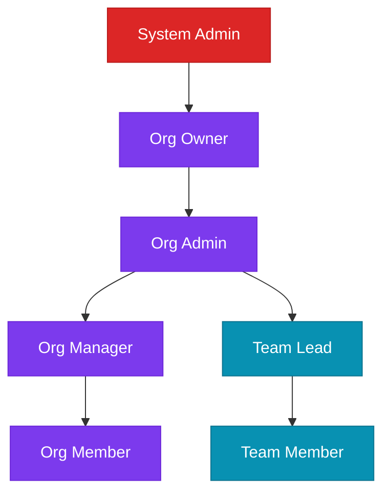

# Security Architecture

Security is foundational to Bagmaster's design — not an afterthought. Every layer of the platform enforces authentication, authorization, and data isolation through well-established industry standards.

---

## Security Layers



---

## Authentication

### OIDC + Keycloak SSO

Bagmaster uses **Keycloak** as its identity provider, supporting enterprise SSO through OpenID Connect (OIDC).

| Feature | Implementation |
|---------|---------------|
| **Protocol** | OAuth 2.0 with PKCE (Proof Key for Code Exchange) |
| **Token format** | JWT (RS256 signed) |
| **Token storage** | HttpOnly cookies (not accessible to JavaScript) |
| **Token refresh** | Automatic, with 30-second pre-expiry buffer |
| **Audiences** | Validated per-service at the gateway |
| **SSL verification** | Enforced in production |

### Zero-Trust Gateway

The API Gateway validates **every request** before it reaches any backend service:

1. **JWT validation** — Token signature, expiry, and audience verified via Keycloak's OIDC discovery
2. **Header injection** — Verified claims extracted and forwarded as trusted headers
3. **No backend token validation** — Services trust the gateway's identity headers, eliminating redundant crypto operations

:::tip Why Zero-Trust?
Backend services never see raw JWT tokens. They receive pre-validated identity headers from the gateway. This means a compromised service cannot forge identity claims — only the gateway has access to the signing keys.
:::

---

## Authorization

### Role-Based Access Control (RBAC)

Bagmaster implements a hierarchical RBAC model:



### Cerbos Policy Engine

For fine-grained authorization decisions, Bagmaster integrates with **Cerbos** — an open-source, cloud-native authorization layer:

- **Resource-level policies** — Control access to specific resources (bags, experiments, flows)
- **Action mapping** — HTTP methods automatically map to authorization actions (`GET` → `read`, `POST` → `create`, `DELETE` → `delete`)
- **Context-aware** — Policies evaluate user attributes, resource ownership, and tenant membership
- **Externalized policies** — Authorization logic lives outside application code, enabling policy updates without redeployment

---

## Multi-Tenant Isolation

### Three-Level Isolation

Data isolation is enforced at multiple layers to prevent cross-tenant access:

| Level | Mechanism | Enforced At |
|-------|-----------|------------|
| **Database** | `WHERE owner_id = :user AND org_id = :org` | Repository layer |
| **Object Storage** | Tenant-prefixed S3 paths (`org_id/team_id/user_id/`) | Storage service |
| **Execution** | Tenant-scoped Jenkins folders (`tenant-{org_id}`) | Action service |

### Identity Header Chain

```
Keycloak → API Gateway → OIDC Headers → Service → Database Query
```

Every service extracts tenant context from OIDC headers and applies it as query filters. This happens at the **repository layer** (not the controller), ensuring that even internal code paths cannot bypass tenant boundaries.

:::caution Defense in Depth
Tenant isolation is enforced at the **data access layer**, not the API layer. This means even if a service endpoint has a bug that skips authorization checks, the database queries still filter by tenant — providing a critical safety net.
:::

---

## API Security

### Rate Limiting

The API Gateway enforces rate limits to protect against abuse:

| Scope | Limit |
|-------|-------|
| Per minute | 10,000 requests |
| Per hour | 100,000 requests |

### CORS Policy

Cross-Origin Resource Sharing is configured per-service with strict origin validation in production:

- **Development**: All origins allowed for local testing
- **Production**: Restricted to specific frontend domains
- **Credentials**: Enabled for cookie-based authentication
- **Preflight caching**: 1 hour max-age for OPTIONS responses

### WebSocket Security

For interactive notebook sessions, WebSocket connections are:
- Authenticated via the same OIDC flow
- Proxied through the API Gateway
- Scoped to the session owner

---

## Container Security

All services follow container security best practices:

| Practice | Implementation |
|----------|---------------|
| **Non-root execution** | Containers run as `appuser` (unprivileged) |
| **Minimal images** | Based on `python:3.11-slim` to reduce attack surface |
| **No embedded secrets** | Credentials injected via environment variables |
| **Read-only layers** | Application code is immutable in the container image |
| **Health probes** | Liveness and readiness checks for automatic recovery |
| **Dependency pinning** | All package versions locked in `requirements.txt` |

---

## Data Protection

### Secrets Management

- **Database credentials** — Injected via environment variables, never committed to code
- **API keys** — Stored in environment configuration, rotatable without redeployment
- **JWT signing keys** — Managed by Keycloak, services never access private keys
- **S3 credentials** — Injected per-service, supporting key rotation

### Audit Capabilities

Bagmaster maintains audit trails across critical operations:

- **Storage operations** — Every upload and download tracked with user identity, timestamps, and access method
- **Pipeline executions** — Full state history with timestamps for each transition
- **User management** — Account creation, role changes, and invitation tracking
- **Soft deletes** — Critical data is logically deleted, preserving audit history

---

## Compliance Readiness

Bagmaster's security architecture supports compliance with common frameworks:

| Requirement | How Bagmaster Addresses It |
|-------------|---------------------------|
| **Access control** | RBAC + Cerbos policies + tenant isolation |
| **Authentication** | Enterprise SSO via Keycloak (OIDC/SAML) |
| **Audit logging** | Storage audit trail + execution state history |
| **Data isolation** | Multi-tenant scoping at database and storage layers |
| **Encryption in transit** | TLS at the gateway, internal network isolation |
| **Least privilege** | Non-root containers, scoped API tokens, role hierarchy |
