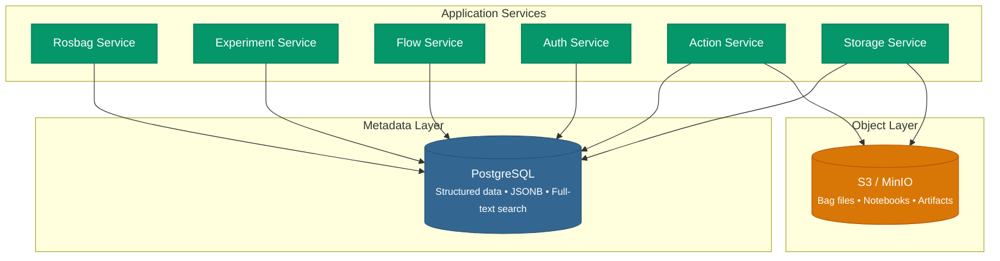
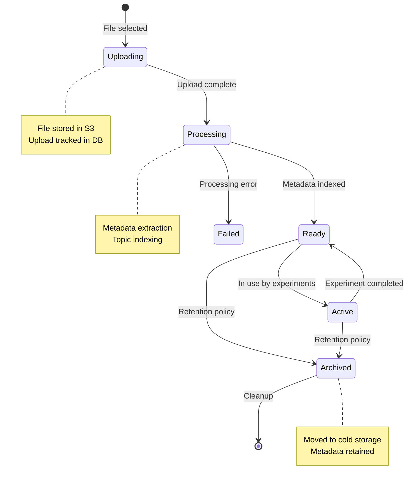

# Storage Architecture

Bagmaster separates **metadata storage** (PostgreSQL) from **object storage** (S3/MinIO), enabling each layer to scale independently and serve its distinct access patterns optimally.

---

## Storage Topology



---

## PostgreSQL — Metadata Layer

Each service manages its own database schema, following the **database-per-service** pattern. All services share a single PostgreSQL instance but use separate databases or schema namespaces.

### Key Design Patterns

| Pattern | Implementation | Benefit |
|---------|---------------|---------|
| **Async I/O** | `asyncpg` + SQLAlchemy async sessions | Non-blocking queries under load |
| **JSONB columns** | Rosbag metadata, onboarding data, flow labels | Flexible schema without migrations |
| **Composite keys** | Flow Service: `(namespace, id, revision)` | Immutable revision history |
| **Soft deletes** | `deleted` flag on critical entities | Audit compliance, recoverable data |
| **Row-level locking** | `SELECT ... FOR UPDATE` on array operations | Thread-safe concurrent modifications |
| **Schema migrations** | Alembic with async engine support | Reproducible, version-controlled changes |

### Multi-Tenant Query Scoping

Every service enforces tenant isolation at the query level:


:::caution Defense in Depth
Tenant filtering is applied at the **repository layer**, not the controller layer. This ensures that even internal service calls cannot bypass tenant boundaries.
:::

---

## S3 / MinIO — Object Layer

The Storage Service manages all binary data through an S3-compatible API, supporting both AWS S3 and self-hosted MinIO deployments.

### Object Key Structure

Files are organized with tenant-scoped prefixes to enforce isolation at the storage layer:

```
{org_id}/
  {team_id}/
    {user_id}/
      {uuid}_{timestamp}_{filename}.{ext}
```

For personal files (no team context):
```
personal/
  {user_id}/
    {ulid}_{safe_filename}.{ext}
```

### Upload Strategies

| Strategy | Use Case | File Size |
|----------|----------|-----------|
| **Standard upload** | Small files, metadata, notebooks | < 64 MB |
| **Multipart upload** | Bag files, large datasets | > 64 MB |
| **Native MinIO multipart** | Automatic chunking with configurable part size | Any size |

### Download Strategies

| Strategy | Description | Performance |
|----------|-------------|-------------|
| **Presigned URL redirect** | Client downloads directly from S3 | Best — zero API bandwidth |
| **Streaming proxy** | API streams file content to client | Good — for access control scenarios |
| **Direct download** | Full file buffered through API | Acceptable — smallest files only |

:::tip Presigned URL Strategy
For production workloads, Bagmaster defaults to **presigned URL redirects**. This offloads download bandwidth entirely to the S3 backend, keeping the API layer lightweight and responsive. URLs are time-limited (default 15 minutes) for security.
:::

---

## Data Lifecycle



---

## Storage Audit Trail

The Storage Service maintains a complete audit trail for compliance and debugging:

**Upload events** record:
- Uploader identity (keycloak_id, email)
- File metadata (key, size, content type)
- Tenant context (org_id, team_id)
- Upload method (standard, multipart)
- Timestamps (initiated, completed)

**Download events** record:
- Requester identity
- Access method (presigned, redirect, direct)
- Client metadata (IP address, user agent)
- Timestamps

---

## Quota Management

Storage quotas can be configured at three levels:

| Level | Scope | Enforced By |
|-------|-------|-------------|
| **User** | Individual storage limits | Storage Service |
| **Team** | Shared team allocation | Storage Service |
| **Organization** | Total org-wide capacity | Storage Service |

Quotas track both **storage bytes** and **file count**, enabling fine-grained resource governance.
