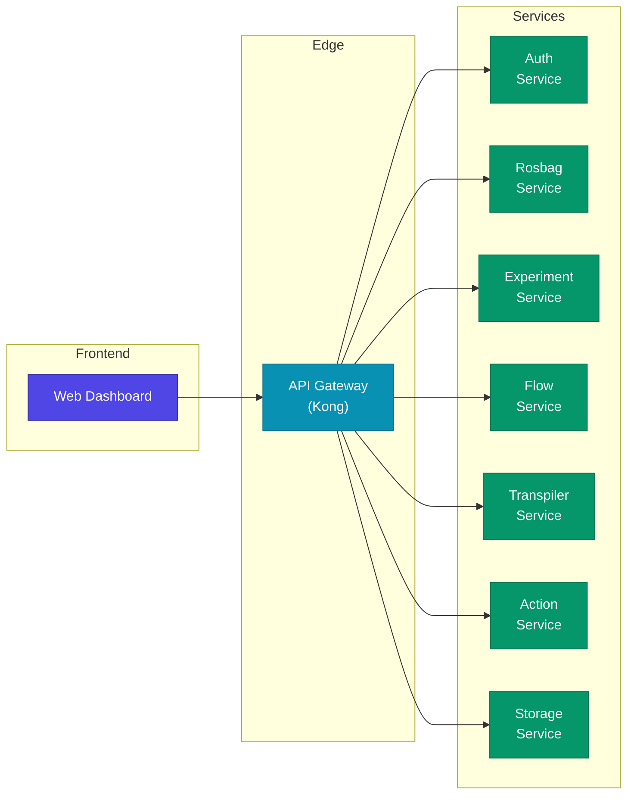
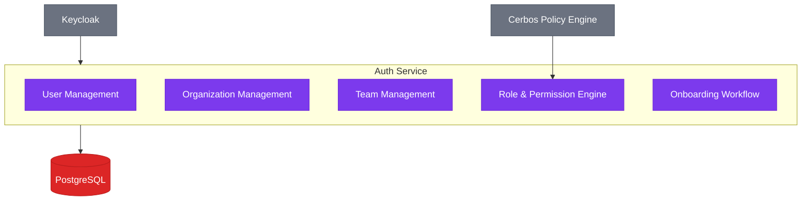
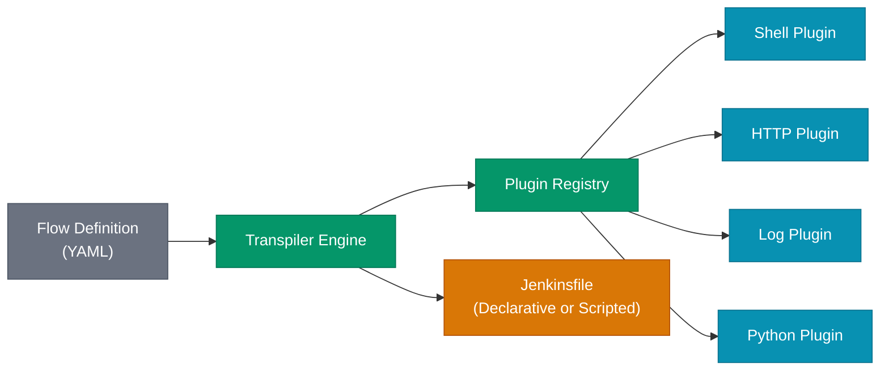
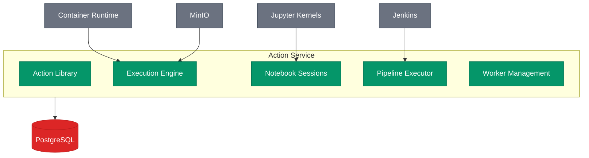

# System Design

Bagmaster follows a **domain-driven microservices architecture** where each service owns its data, exposes a clean REST API, and communicates through the API Gateway. This page details the responsibilities and interactions of every service in the platform.

---

## Service Map

---

## API Gateway

The **Kong API Gateway** serves as the single entry point for all client requests. It operates in **DB-less declarative mode** for maximum simplicity and reproducibility.

**Responsibilities:**
- **Request routing** — Maps URL paths to backend services
- **Authentication** — Validates JWT tokens via Keycloak OIDC plugin
- **Header injection** — Propagates user identity (`x-oidc-sub`, `x-oidc-email`, `x-oidc-org-id`) to downstream services
- **Rate limiting** — Protects services from excessive load
- **CORS enforcement** — Manages cross-origin policies per service
- **TLS termination** — Handles HTTPS at the edge

:::tip Zero-Trust Architecture
No service trusts raw client requests. Every authenticated request carries verified identity headers injected by the gateway after OIDC validation. Services never perform their own token validation.
:::

---

## Auth Service

The **Auth Service** manages identity, multi-tenant organizations, and role-based access control.

**Key capabilities:**
- **JIT user provisioning** — Automatically creates users on first OIDC authentication
- **Organization hierarchy** — Organizations contain teams; users hold roles at each level
- **Invitation system** — Token-based invitations with expiry for secure member onboarding
- **Cerbos integration** — Fine-grained policy decisions for resource-level authorization

**Role hierarchy:** `system_admin` > `org_owner` > `org_admin` > `org_manager` > `org_member` | `team_lead` > `team_member`

---

## Rosbag Service

The **Rosbag Service** is the metadata backbone for ROS bag file management. It indexes bag files, their constituent topics, and supports schema-on-read metadata exploration.

**Key capabilities:**
- **Rich metadata indexing** — Duration, message counts, compression format, timestamps
- **Topic management** — Tracks ROS topics, message types, QoS profiles, and serialization formats
- **Dynamic metadata exploration** — JSON path autocomplete and projection queries on arbitrary metadata
- **Advanced filtering** — Filter by status, date range, tags, and metadata fields with operators (`eq`, `gt`, `lt`, `iLike`)

:::info Schema-on-Read
Rosbag metadata uses a JSONB column in PostgreSQL, enabling teams to attach arbitrary structured data to bags without schema migrations. The metadata exploration API dynamically discovers and queries these fields.
:::

---

## Experiment Service

The **Experiment Service** manages the lifecycle of data experiments — from creation through execution to analysis.

**Key capabilities:**
- **Experiment lifecycle** — States: `scheduled` → `running` → `completed` / `failed` / `cancelled`
- **Bagfile linking** — Associate any number of rosbags with an experiment
- **Tagging and comments** — Organize and annotate experiments collaboratively
- **Flexible metadata** — Attach arbitrary key-value pairs for domain-specific tracking
- **Atomic array operations** — Thread-safe add/remove on bagfiles, tags, and comments via row-level locking

---

## Flow Service

The **Flow Service** provides a workflow definition engine with versioning, validation, and input schema generation.

**Key capabilities:**
- **YAML-based flow definitions** — Define multi-step workflows with tasks, inputs, and error handling
- **Immutable revision history** — Every update creates a new revision; full audit trail preserved
- **13 input types** — `STRING`, `INT`, `FLOAT`, `BOOLEAN`, `DATE`, `DATETIME`, `DURATION`, `FILE`, `JSON`, `SECRET`, `URI`, `ENUM`, `MULTISELECT`
- **JSON Schema generation** — Auto-generates JSON Schema from flow input definitions for UI rendering
- **Input validation** — Validates execution inputs with type checking, range bounds, pattern matching, and enum enforcement

---

## Transpiler Service

The **Transpiler Service** converts abstract flow definitions into executable CI/CD pipeline scripts. It uses a **plugin-based architecture** for extensibility.

**Key capabilities:**
- **Plugin architecture** — Register custom converters for new task types
- **Multi-format output** — Generates both Declarative and Scripted Jenkins pipelines
- **Validation at three levels** — Structure validation, field validation, and compatibility checking
- **Template conversion** — Maps flow template variables to Jenkins pipeline parameters
- **Plugin discovery API** — Enumerate available converters and their supported field schemas

---

## Action Service

The **Action Service** is the execution backbone of Bagmaster — orchestrating notebook runs, interactive sessions, and Jenkins pipeline executions.

**Key capabilities:**
- **Action library** — Reusable notebook and script templates with built-in and custom actions
- **Headless execution** — Run actions in isolated Docker containers with configurable CPU/memory limits
- **Interactive notebooks** — Spin up JupyterLab sessions with TTL-based auto-cleanup
- **Jenkins pipelines** — Execute transpiled flows with full state tracking (`QUEUED` → `RUNNING` → `SUCCESS` / `FAILED`)
- **Worker node management** — Register and monitor inbound Jenkins agent nodes with live health metrics

---

## Storage Service

The **Storage Service** provides a unified file management layer backed by S3-compatible object storage.

**Key capabilities:**
- **ULID-based file keys** — Timestamp-sortable unique identifiers for every upload
- **Multipart upload** — Efficient handling of large files (> 64 MB) via native S3 multipart
- **Presigned URLs** — Offload download bandwidth directly to S3 with time-limited access tokens
- **Audit trail** — Database-tracked upload and download events per user
- **Quota management** — Per-user, per-team, and per-organization storage quotas

---

## Service Interaction Matrix

| Service | Depends On | Called By |
|---------|-----------|----------|
| **API Gateway** | Keycloak | Frontend |
| **Auth Service** | Keycloak, Cerbos, PostgreSQL | Gateway |
| **Rosbag Service** | PostgreSQL | Gateway, Frontend |
| **Experiment Service** | PostgreSQL | Gateway, Frontend |
| **Flow Service** | PostgreSQL | Gateway, Transpiler, Action |
| **Transpiler Service** | PostgreSQL | Gateway, Action |
| **Action Service** | Jenkins, Docker, MinIO, PostgreSQL | Gateway, Frontend |
| **Storage Service** | MinIO/S3, PostgreSQL | Gateway, Frontend |

---

## Shared Patterns

All backend services follow consistent architectural patterns:

1. **FastAPI + async SQLAlchemy** — Non-blocking I/O throughout the stack
2. **Alembic migrations** — Version-controlled database schema management
3. **Pydantic v2 schemas** — Request/response validation with automatic OpenAPI generation
4. **Health endpoints** — `/health` (liveness) and `/health/ready` (readiness) on every service
5. **OIDC header extraction** — Standardized `CurrentUser` dependency across all services
6. **Non-root containers** — Docker images run as unprivileged `appuser`
7. **Soft deletes** — Critical data uses logical deletion for audit compliance
